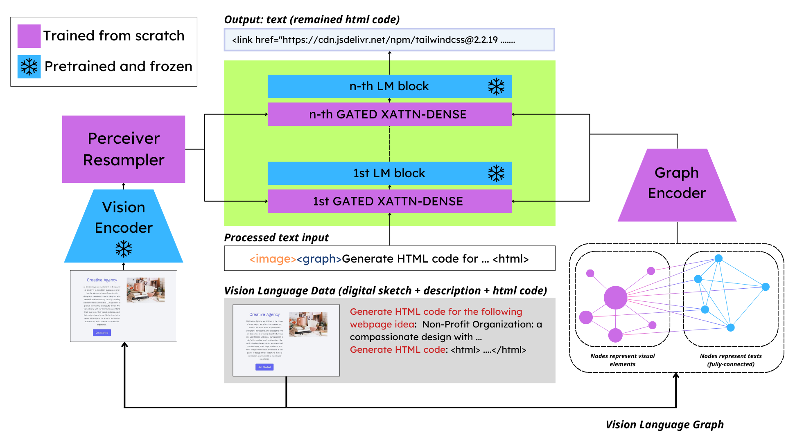

<div align="center">

# Multimodal graph representation learning for website source code generation given visual sketch

Our technical [report](Multimodal_Graph_Representation_Learning_For_Website_Generation_Based_on_Visual_Sketch.pdf) 
</div>

# Overview



<br/><br/>
We present a novel approach to solving the Design2Code problem by integrating multimodal information through a graph-based model that captures the spatial and semantic relationships within webpage designs. Our OCR-Segmentation pipeline effectively isolates textual content, allowing for more accurate segmentation of visual elements. The proposed graph-enhanced vision-language model bridges the gap between visual comprehension and code generation, resulting in improved HTML generation in terms of both layout fidelity and content accuracy. Our extensive experiments validate the effectiveness of this approach, offering a significant advancement toward automated code generation from web designs.
<br/><br/>

# Preparation
#### Download our repository
```bash
git clone https://github.com/HySonLab/Design2Code.git
cd Design2Code
```

#### Prepare conda environment and install dependencies (this step may take time)
```bash
conda env create -f environment.yml   # create graphui2code env
conda activate graphui2code           # activate
```

#### Install SAM model for segmentation and simfang.ttf font for visualization
```bash
wget https://dl.fbaipublicfiles.com/segment_anything/sam_vit_b_01ec64.pth            # Install Segment Anything model
```

# Training
#### Before running training script, please go to `scripts/run_train.sh` and modify your own `LD_LIBRARY_PATH` environment variable as follow:
```bash
export LD_LIBRARY_PATH="/path/to/miniconda3/envs/graphui2code/lib"
```
#### Then, run the script as follow:
```bash
sh scripts/run_train.sh
```

# Inferencing
#### Before running inference script, also go to `scripts/run_inference.sh` and modify `LD_LIBRARY_PATH` as follow:
```bash
export LD_LIBRARY_PATH="/path/to/miniconda3/envs/graphui2code/lib"
```
#### Then, run the inference script:
```bash
sh scripts/run_inference.sh
```

# Evaluation on Design2Code metrics
#### Design2Code metrics include Block-Match, Text, Position, Color, CLIP
#### Run the evaluation script as follow:
```bash
python eval/eval_design2code_metrics.py
```

# Evaluation on traditional metrics
#### We also provide code to evaluation on traditional metrics including BLEU, MSE, SSIM, TreeBLEU, WeightedBLEU
```bash
python eval/eval_traditional_metrics.py
```

# Reference
1. [OpenFlamingo](https://github.com/mlfoundations/open_flamingo)
2. [Design2Code](https://github.com/NoviScl/Design2Code)

# Contact us
If you have any questions, comments or suggestions, please do not hesitate to contact us.
- Email: vdtung21.work@gmail.com